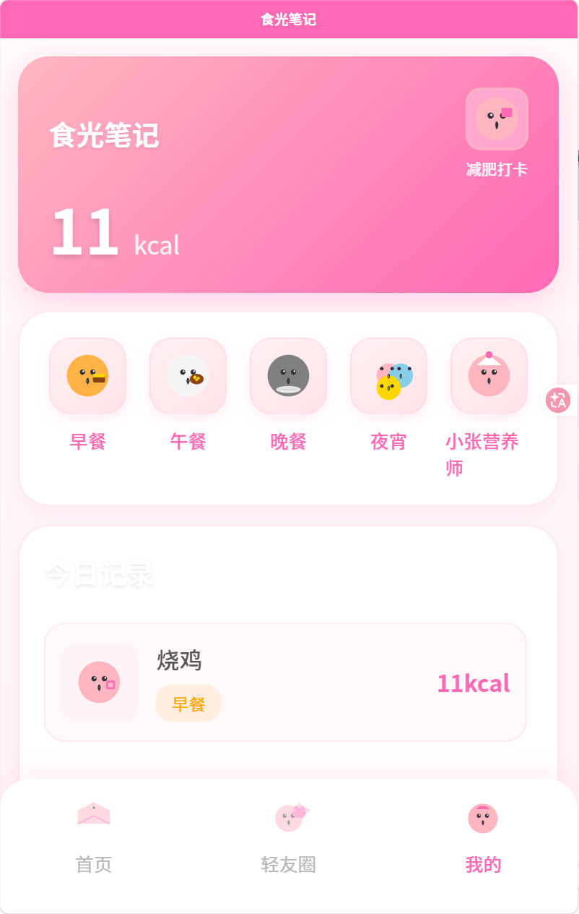
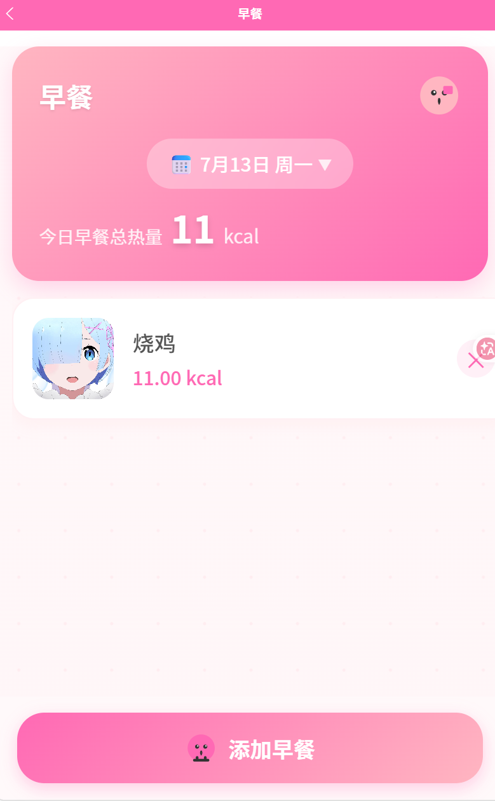
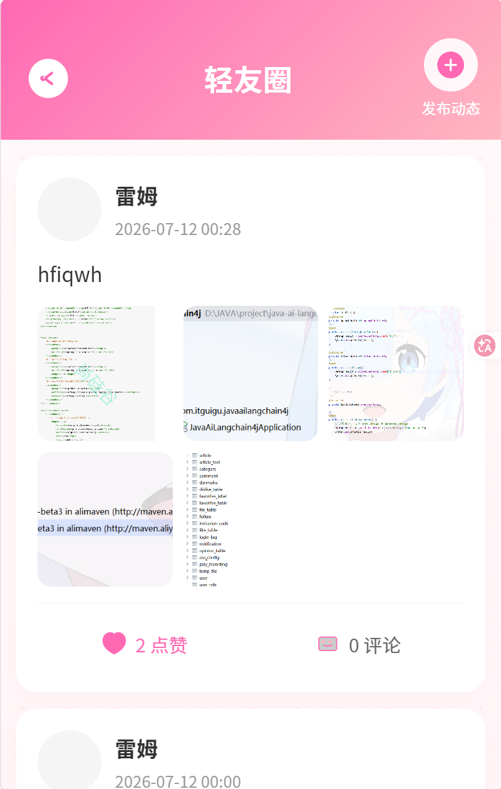
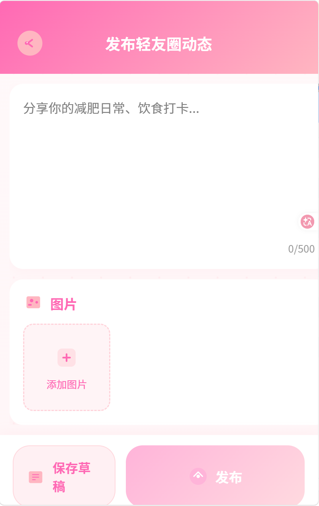
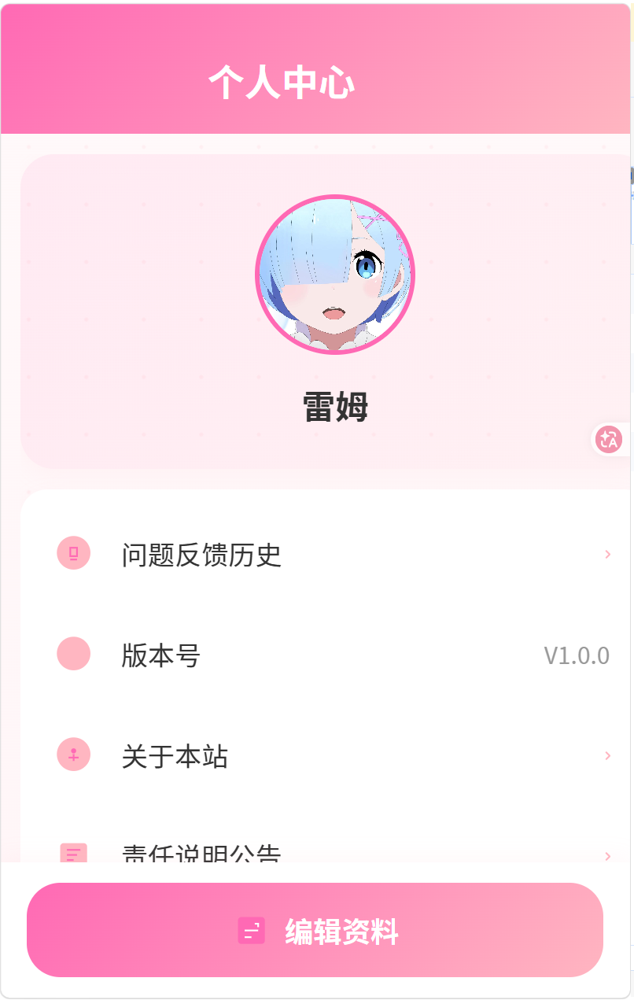

# 营养管理系统

> 智能食物热量计算与营养摄入统计平台

## 项目介绍

营养管理系统是一款面向健康管理人群的智能营养助手小程序，通过 AI 技术帮助用户精准计算食物热量，记录饮食摄入，提供个性化营养建议。核心能力包括饮食记录与热量统计、AI 营养问答、内容合规审核等，致力于为用户提供科学、便捷的健康管理体验。

**面向人群**：关注健康饮食、需要控制体重、追求营养均衡的用户群体

## 技术栈

### 后端技术

| 技术 | 版本 | 说明 |
|------|------|------|
| Spring Boot | 3.2.2 | 应用框架 |
| MyBatis-Plus | 3.5.7 | ORM 框架 |
| MySQL | 8.0+ | 数据库 |
| Redis | 7.0+ | 缓存与会话管理 |
| JWT | 0.12.5 | 身份认证 |
| 阿里云 OSS | - | 对象存储 |
| 微信内容安全 API | v1/v2 | 内容审核 |
| Hutool | 5.8.25 | 工具库 |
| Sensitive-Word | 0.27.0 | 敏感词检测 |

### 前端技术

| 技术 | 说明 |
|------|------|
| Vue 3 | 前端框架 |
| TypeScript | 类型安全 |
| uni-app | 跨平台框架（微信小程序 + H5） |
| uView Plus | UI 组件库 |

## 特色功能

- **AI 营养助手**：智能问答，提供营养建议(暂未开发)
- **热量计算**：手动输入或 AI 估算食物热量
- **饮食记录**：记录早中晚餐及加餐，统计每日热量摄入
- **内容审核**：图片与文本安全审核，确保社区内容合规
- **社区互动**：动态发布、点赞、评论
- **打卡功能**：每日健康打卡记录
- **用户管理**：个人信息管理、问题反馈
## 功能截图









## 项目结构

```
nutrition-all/
├── nutrition-server/           # 后端服务
│   ├── src/main/java/com/nutrition/
│   │   ├── controller/        # 控制层
│   │   ├── service/           # 业务层
│   │   ├── mapper/            # 数据访问层
│   │   ├── entity/            # 实体类
│   │   ├── vo/                # 视图对象
│   │   ├── param/             # 请求参数
│   │   ├── config/            # 配置类
│   │   ├── enums/             # 枚举类
│   │   ├── common/            # 公共组件
│   │   ├── util/              # 工具类
│   │   └── task/              # 定时任务
│   ├── src/main/resources/
│   │   ├── mapper/            # MyBatis 映射文件
│   │   ├── db/                # 数据库脚本
│   │   └── application.yml    # 配置文件
│   └── pom.xml                # Maven 依赖
│
├── nutrition-miniapp/         # uni-app 前端（微信小程序 + H5）
│   ├── src/
│   │   ├── pages/             # 页面组件
│   │   ├── api/               # API 接口封装
│   │   ├── components/        # 公共组件
│   │   ├── stores/            # 状态管理
│   │   ├── styles/            # 样式文件
│   │   └── utils/             # 工具函数
│   └── package.json           # 前端依赖
│
│
└── docs/                      # 文档
    ├── API.md                 # API 文档
    └── DEPLOY.md              # 部署文档
```

## 快速启动

### 环境要求

- JDK 17+
- MySQL 8.0+
- Redis 7.0+
- Node.js 18+
- Maven 3.8+

### 数据库初始化

1. 创建数据库：
```sql
CREATE DATABASE nutrition_db CHARACTER SET utf8mb4 COLLATE utf8mb4_unicode_ci;
```

2. 执行初始化脚本：
```bash
mysql -u username -p nutrition_db < nutrition-server/src/main/resources/db/nutrition_db.sql
```

### 配置文件修改

修改 `nutrition-server/src/main/resources/application.yml`：

```yaml
server:
  port: 8088

spring:
  datasource:
    url: jdbc:mysql://localhost:3306/nutrition_db?useSSL=false&serverTimezone=Asia/Shanghai&characterEncoding=utf8mb4
    username: your_username
    password: your_password

  data:
    redis:
      host: localhost
      port: 6379

# 微信小程序配置（通过环境变量设置）
wx:
  mini:
    appid: ${WX_MINI_APPID}
    appsecret: ${WX_MINI_APPSECRET}
    audit-version: 1

# 阿里云 OSS 配置
oss:
  endpoint: your-oss-endpoint
  bucket-name: your-bucket-name
  access-key-id: your-access-key-id
  access-key-secret: your-access-key-secret
```

### 后端启动

```bash
cd nutrition-server
mvn spring-boot:run
```

服务启动后访问：http://localhost:8088

### 前端启动（uni-app）

```bash
cd nutrition-miniapp
npm install
npm run dev:h5          # H5 开发模式
npm run build:h5        # H5 构建
npm run dev:mp-weixin   # 微信小程序开发模式
npm run build:mp-weixin # 微信小程序构建
```

## 核心功能模块

### 1. 饮食记录与热量统计

- 记录早、中、晚餐及加餐
- AI 估算食物热量
- 每日热量摄入统计
- 食物列表管理

### 2. 内容审核

- 图片安全审核（微信内容安全 API）
- 文本敏感词检测
- 审核记录管理
- v1/v2 版本配置化切换

### 3. AI 营养问答

- 营养咨询对话
- 热量计算建议
- 历史对话记录

### 4. 用户管理

- 微信小程序登录
- 个人信息管理
- 头像上传与审核
- 问题反馈

### 5. 社区互动

- 动态发布
- 点赞与评论
- 动态列表展示

## API 文档

启动后端服务后访问：http://localhost:8088/swagger-ui.html

详细 API 文档请参考：[docs/API.md](docs/API.md)

## 开发规范

### 后端规范

- 遵循阿里巴巴 Java 开发手册
- 使用 DTO/VO 模式进行数据传输
- 参数校验使用 `@Valid` + JSR-380 注解
- 异常处理使用统一的 `Result<T>` 返回格式
- 事务管理使用 `@Transactional`

### 前端规范

- TypeScript 严格模式
- 组件化开发
- 统一的 API 接口封装
- 响应式状态管理

## 部署说明

详细部署指南请参考：[docs/DEPLOY.md](docs/DEPLOY.md)

## 许可证
本项目开源协议为 [MIT License](./LICENSE)，详情见仓库根目录 LICENSE 文件。

## 贡献

欢迎提交 Issue 和 Pull Request！